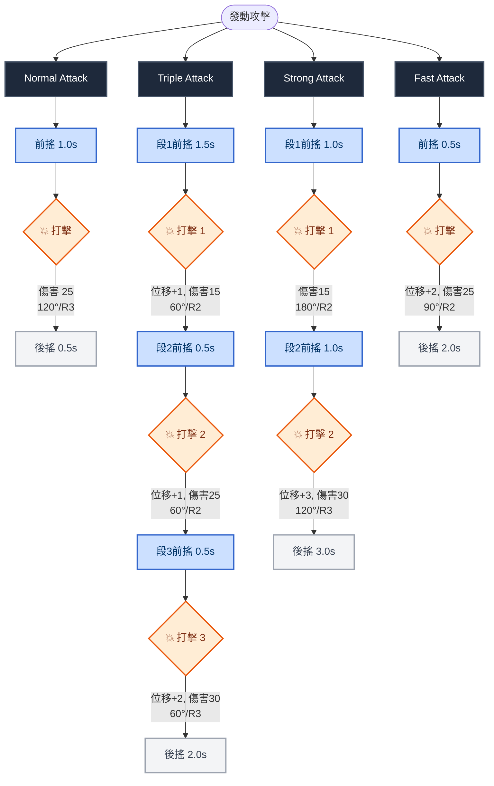
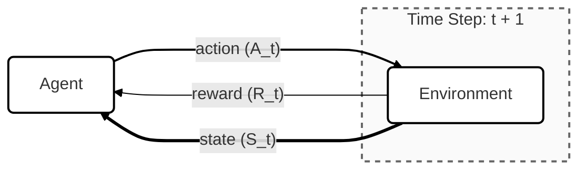

# 從模仿到對抗：VR 物理驅動 Agent 學習玩家行為習慣與動態反制之策略研究

[](https://unity.com/)
[](https://github.com/Unity-Technologies/ml-agents)
[](https://www.khronos.org/openxr/)
[](https://docs.unity3d.com/Packages/com.unity.xr.interaction.toolkit@3.3/manual/index.html)

本專題旨在利用 VR 多模態感測數據（視線、姿態），透過對抗與模仿學習（PPO、GAIL、BC），建構能即時預測、動態適應並反制玩家意圖之進化型敵人 AI，打造具深度沉浸感的寫實對戰體驗。

---

## 📂 目錄
1. [⚔️ 系統實體規範與機制](#%EF%B8%8F-系統實體規範與機制)
2. [💥 敵人攻擊模式 (Mermaid)](#-敵人攻擊模式-mermaid)
3. [🎮 玩家自動化模式 (Bot 策略總覽)](#-玩家自動化模式-bot-策略總覽)
4. [🤖 強化學習架構與演算法](#-強化學習架構與演算法)
5. [👁️ 特徵工程：觀測空間規範](#%EF%B8%8F-特徵工程觀測空間規範)
6. [🏆 特徵工程：獎勵函數規範](#-特徵工程獎勵函數規範)
7. [🎯 訓練過程之 5 大核心演化趣事](#-訓練過程之-5-大核心演化趣事)
8. [⚙️ 訓練設定檔 (Config) 關鍵參數詳細拆解](#%EF%B8%8F-訓練設定檔-config-關鍵參數詳細拆解)
    - [🟢 敵人基礎訓練設定 (vr_enemy_attack)](#-敵人基礎訓練)
    - [🔵 玩家行為模仿與對抗建立 (vr_gail)](#-玩家行為模仿與對抗建立)
    - [🟡 敵人動態微調與反制演化 (vr_gail_finetune)](#-敵人動態微調與反制演化)
9. [💻 環境部署與訓練指令](#-環境部署與訓練指令)
10. [🚀 專案規劃與展望](#-專案規劃與展望)

---

## ⚔️ 系統實體規範與機制

### 1. 進化型敵人 (VR_Enemy)
* **基礎屬性**：血量 100、移動速度 3f。
* **視覺狀態表現**：
    * **橘色長方體**：標準準備狀態（Idle），尋找進攻或閃避時機。
    * **漸變至紅色**：**攻擊前搖**蓄力狀態，變成全紅的瞬間觸發傷害判定。
    * **綠色**：**攻擊後搖（硬直狀態）**，此期間敵人只能移動、無法攻擊。

### 2. 玩家/代理人 (Player / Agent)
* **基礎屬性**：血量 100、移動速度 5f。
* **操作特性**：近距離攻擊時身體無法移動；快速位移（Dash）冷卻結束後可自由施放。
* **VR 版本升級**：捨棄傳統 3D 遊戲「進入範圍即扣血」的判定，改由真實控制器動能驅動。只有當武器（劍尖）以**足夠的角速度（$\ge$ 3 rad/s）**實體擊中敵人時，才會觸發傷害判定。

---

## 敵人攻擊模式



---

## 🎮 玩家自動化模式 (Bot 策略總覽)

| 策略名稱 | 移動行為 | 攻擊邏輯 | 戰術目的 / 訓練亮點 |
| :--- | :--- | :--- | :--- |
| **AutoTrace** | 自動往敵人方向靠近 | 進入一定距離後**持續攻擊** | 基礎對戰測試，提供 AI 基本的近戰應對環境。 |
| **OnlyDash** | 在敵人周圍進行 Dash 移動 | **不攻擊** | 專門**訓練 AI 學習抓準人類的衝刺/移動時間**。 |
| **AttackAndRun** | 進入範圍攻擊，攻擊後**馬上遠離**，冷卻時繞敵人轉圈 | 攻擊冷卻好才再次靠近 | 測試 AI 面對「一擊脫離」與牽制拉鋸時的追擊能力。 |
| **AttackAndDash** | 進入範圍攻擊，攻擊後**使用 Dash 遠離**，冷卻時繞敵人轉圈 | 攻擊冷卻好才再次靠近 | 測試 AI 面對高機動力玩家快攻拉打時的反應。 |
| **SmartAttack** | 攻擊後 **Dash 離開**，隨時保持在敵人攻擊範圍外 | **敵方出現攻擊後搖（硬直）**才靠近反擊 | **高難度擬真測試**：強迫 AI 必須減少空振（揮空），否則會被瘋狂抓後搖進行懲罰。 |
| <del>**SmartTrace**</del> | 自動靠近，但與敵人保持適當距離 | — | *（已廢棄）預期做拉打但邏輯重疊。* |
| <del>**OnlyAttack**</del> | 原地不移動，等敵人靠近 | 敵人進入一定距離才攻擊 | *（已廢棄）木樁測試，缺乏動態數據。* |

---

## 🤖 強化學習架構與演算法

本專案使用 ==Proximal Policy Optimization (PPO)== 演算法作為核心基礎，並引入生成對抗模仿學習（GAIL）與行為克隆（BC）進行複雜戰術微調。



### PPO 核心目標函數
$$L(\theta) = \hat{\mathbb{E}}_t \left[ \min\left( r_t(\theta) \hat{A}_t, \text{clip}(r_t(\theta), 1-\epsilon, 1+\epsilon) \hat{A}_t \right) \right]$$

其中：
- $\hat{\mathbb{E}}_t$：表示對樣本數據的期望值。
- $r_t(\theta)$：新舊策略的機率比率 $\frac{\pi_\theta(a_t|s_t)}{\pi_{\theta_{old}}(a_t|s_t)}$，表明新舊策略選擇特定動作的機率比例。
- $\hat{A}_t$：優勢函數 (Advantage Function)，用以估計在狀態 $s_t$ 下採取動作 $a_t$ 比平均策略好多少。
- $\text{clip}$：剪裁函數，將 $r_t(\theta)$ 的值限制在 $[1-\epsilon, 1+\epsilon]$ 範圍內。

藉由數學剪裁（Clip）機制，將策略更新限制在安全的信賴區域（Trust Region）內，完美避免了博弈對抗訓練中的「策略崩潰」與不穩定現象。

---

## 👁️ 特徵工程：觀測空間規範

#### 1. VR 玩家代理人 (VR_Player_Agent) — 總維度：30 維
| 特徵名稱 (Feature) | 維度 | 數據類型 / 說明 |
| :--- | :---: | :--- |
| **enemyState** | 4 | One-hot 編碼：`Idle`, `StartUp`, `Recovery`, `Defending` (掌握敵方當前狀態) |
| **localTargetPos** | 3 | 3D 向量 ($x, y, z$)：玩家座標系下的敵人位置 |
| **dist** | 1 | 純量 ($f$)：玩家到敵人的歐幾里得距離 |
| **enemyProg** | 1 | 純量 ($f$)：敵人當前動作的執行進度百分比 ($0.0 \sim 1.0$) |
| **enemyRelVel** | 3 | 3D 向量 ($x, y, z$)：敵人在玩家座標系下的相對速度 |
| **myRelVel** | 3 | 3D 向量 ($x, y, z$)：玩家自身的移動速度 |
| **canDash** | 1 | 布林值 ($0/1$)：玩家當前是否可執行衝刺 (Dash) |
| **playerHpNorm** | 1 | 純量 ($f$)：玩家當前血量比例 ($\text{HP} / \text{maxHP}$) |
| **enemyHpNorm** | 1 | 純量 ($f$)：敵人當前血量比例 ($\text{HP} / \text{maxHP}$) |
| **relativeSwordTip** | 3 | 3D 向量 ($x, y, z$)：劍尖相對於玩家的空間位置 |
| **swordLPos** | 3 | 3D 向量 ($x, y, z$)：武器的局部座標位置 (`localPosition`) |
| **swordFwd** | 3 | 3D 向量 ($x, y, z$)：武器的前方朝向向量 (`transform.forward`) |
| **swordUp** | 3 | 3D 向量 ($x, y, z$)：武器的上方朝向向量 (`transform.up`) |

#### 2. 進化型敵人 (VR_Enemy) — 總維度：24 維
| 特徵名稱 (Feature) | 維度 | 數據類型 / 說明 |
| :--- | :---: | :--- |
| **enemyForward** | 3 | 3D 向量 ($x, y, z$)：敵人自身的世界朝向面向 |
| **localPlayerPos** | 3 | 3D 向量 ($x, y, z$)：敵人座標系下的玩家相對位置 |
| **playerVel** | 3 | 3D 向量 ($x, y, z$)：玩家移動速度轉換至敵人座標系後的向量 |
| **playerForward** | 3 | 3D 向量 ($x, y, z$)：玩家朝向面向轉換至敵人座標系後的向量 |
| **curState** | 1 | 整數 ($i$)：敵人自身的狀態機編號 (State ID) |
| **actionProgress** | 1 | 純量 ($f$)：敵人自身當前動作的執行進度百分比 ($0.0 \sim 1.0$) |
| **enemyHP** | 1 | 純量 ($f$)：敵人血量百分比 ($0.0 \sim 1.0$) |
| **playerHP** | 1 | 純量 ($f$)：玩家血量百分比 ($0.0 \sim 1.0$) |
| **IsHoldingWeapon** | 1 | 布林值 ($0/1$)：當前是否持有/裝備武器 |
| **WeaponVelocity** | 3 | 3D 向量 ($x, y, z$)：武器在世界座標系下的線速度 (用於判定揮劍物理動能) |
| **WeaponAngularVelocity**| 1 | 純量 ($f$)：武器的旋轉角速度 |
| **localWeaponPos** | 3 | 3D 向量 ($x, y, z$)：武器相對於敵人本體局部位置 |

---

## 🏆 特徵工程：獎勵函數規範

| 觸發事件 / 狀態 (Event) | 獎勵值 (Reward) | 類型 (Type) | 戰術引導目的 (Design Intent) |
| :--- | :---: | :---: | :--- |
| **每步生存獎勵** | `+0.00001` | 密集獎勵 (Dense) | 基礎生存維護，給予時間步基礎正反饋。 |
| **成功命中玩家** | `+ (傷害值 / 50.0)` | 密集獎勵 (Dense) | 核心進攻驅動力，鼓勵主動破防並有效打擊。 |
| **受到近戰傷害** | `- (承受傷害 / 60.0)` | 密集獎勵 (Dense) | 懲罰受擊，引導 AI 學習架擋與閃避時機。 |
| **攻擊揮空（角度錯誤）** | `-0.10` | 懲罰 (Penalty) | 強烈懲罰盲目胡亂出招，改善傳統 AI 空振缺陷。 |
| **攻擊揮空（一般情況）** | `-0.05` | 懲罰 (Penalty) | 懲罰無效進攻，促使 AI 走向謹慎的「抓硬直」戰術。 |
| **擊敗玩家（獲勝）** | `+1.0 + (timeBonus * 0.5)` | 稀疏結算 (Sparse)| 終極目標獎勵。`timeBonus` 越高代表贏得越快，**治癒消極走位**。 |
| **被玩家擊敗（失敗）** | `-1.0 + (timeBonus * -0.5)`| 稀疏結算 (Sparse)| 終極失敗懲罰。拖延死局會使扣分微幅減少。 |
| **平手（回合超時）** | `-2.0` | 稀疏結算 (Sparse)| **最嚴厲懲罰**。分數比戰敗還低，強迫 AI 絕對不能無防禦龜縮。 |
| **意外墜落地圖** | `0.0` | 稀疏結算 (Sparse)| 環境邊界例外處理。 |

---

## 🎯 訓練過程之 5 大核心演化趣事

在漫長的多階段對抗優化中，AI 模型展現出了幾次極其有趣且符合博弈論的行為突變：

1. **第 02-03 局：AI 罹患「近身恐懼症」**
   在最初調整獎勵時，由於參數權重設定失準（受擊懲罰相對過重），AI 意外演化出了一種完全消極逃跑、絕不進攻的無賴策略。即使將訓練次數拉長到 100 萬次，AI 也只是學會了「更優雅地後退」，完全不願意跨出攻擊的第一步。
2. **第 09 局：利用「不期而遇」鑽空子（連續攻擊 Bug）**
   在加入 `SmartAttack` 的早期測試中，AI 意外抓到了系統動畫與物理判定同步的漏洞，發展出了超越人類手速的「高頻率連續揮空斬擊」。它發現利用這個 Bug 可以強行在突進時產生密集的判定框，直接把玩家 Bot 堆死，逼得開發團隊必須重新在程式碼層面修正連招限制。
3. **第 21-27 局：在躲避箭矢時發現「幾何美學」**
   為了讓 AI 學會閃避遠距離投射物，實驗團隊引入了「向量內積」獎勵。AI 在經歷幾次被射穿地圖的慘痛懲罰後，驚人地學會了微積分幾何概念：**「只要我的移動方向與箭矢前進方向的點積（Dot Product）接近 0（即保持垂直），我就能以最高效率擦邊閃過子彈」**。至此，AI 的側向大跨步閃躲大功告成。
4. **第 50 局：AI 倒在「沒有時間感」的盲點上**
   在混合近戰與遠戰的對抗中，AI 的 Mean Reward 一度跌入深淵。經分析發現，PPO 本身缺乏時間序列的延續感。對它而言，玩家在 3 秒蓄力瞄準中的「第 0.1秒」和「第 2.9 秒」在狀態觀測（StartUp）上完全一模一樣。AI 當時無法理解「再過 0.1 秒子彈就要射出來了」，導致它總是在最後關頭掉以輕心。這催生了後來導入 **LSTM 真正記憶體機制（Memory）** 的關鍵決定。
5. **第 55 局：「攻擊即是最好的閃避」— 戰術位移突變**
   在給予 AI 閃避獎勵後，AI 發現透過傳統的移動（Move Direction）來閃箭矢太慢了，它竟然歪打正著地學會利用 **`Fast Attack` 技能自帶的「向前瞬間平移 2 個單位」作為位移技**。每當玩家舉弓，AI 不會往旁邊走，而是直接朝玩家反向或側向發動具有突進位移的強烈攻擊，強行用動作的前搖位移「擦」過箭矢的判定，實現了極其硬核的動作遊戲高階操作。

---

## ⚙️ 訓練設定檔 (Config) 關鍵參數詳細拆解

本專案的核心訓練管線由三份 YAML 設定檔驅動，分別負責「敵人基礎近戰能力建立」、「玩家行為模仿（GAN 判別器與克隆建立）」以及「敵人的動態適應微調」。

---

### 🟢 敵人基礎訓練

此檔案用於專案的第一階段，目標是讓敵人 AI（EnemyAI）從零開始，在純環境獎勵（Extrinsic Reward）的驅動下，利用 PPO 演算法學會基礎的移動、追擊與四種核心連招的釋放。

#### 核心參數詳細說明：
* **trainer_type: ppo**
    * **說明**：採用近端策略優化演算法。其核心在於信賴區域更新，透過數學剪裁避免策略在一波訓練中變化過大，是維持格鬥對抗模型不崩潰的基石。
* **batch_size: 4096 / buffer_size: 40960**
    * **說明**：採取**極大的批次與緩衝區架構**（比值為相對穩定的 $1:10$）。由於近戰環境中敵人的移動極其高頻（每幀都在產生相對位移），使用大批次能有效平滑掉移動帶來的隨機噪音，讓 AI 從「宏觀的回合勝負」中去全局收斂，避免為了眼前幾幀的短暫位移而陷入局部最佳解。
* **learning_rate: 0.001**
    * **說明**：設定較高的學習率（搭配 `linear` 遞減）。在訓練初期，AI 是一張白紙，高學習率能讓它快速擺脫盲目亂走的階段，迅速學會「靠近玩家並出招」的基礎邏輯。
* **beta: 0.02**
    * **說明**：熵權重（Entropy Regularization）。控制 AI 嘗試新動作的盲目探索機率。設定為相對高的 `0.02`，配合 `beta_schedule: linear` 隨著時間遞減，確保 AI 在前期能勇於嘗試不同的技能連招組合。
* **hidden_units: 1024 / num_layers: 3**
    * **說明**：**極高容量的神經網路拓撲**。3 層、每層 1024 個神經元。因為觀測空間高達 24 維且涉及複雜的 3D 空間相對速度轉換，需要足夠寬的神經網路來擬合如此高維度的物理特徵函數。
* **memory / sequence_length: 128 / memory_size: 256**
    * **說明**：啟用 **LSTM 循環神經網路**。`sequence_length: 128` 代表 AI 在當下做出抉擇時，大腦能回溯並參考過去 128 個物理步（Step）的時間序列資訊。這對於格鬥遊戲中判斷玩家是在進行「段 1 派生、段 2 前搖」還是「收招硬直」至關重要。
* **max_steps: 20000000 (兩千萬步)**
    * **說明**：由於模型架構龐大且加入了 LSTM，收斂所需的物理步較長，兩千萬步能確保 PPO 策略網路達到完全收斂。

---

### 🔵 玩家行為模仿與對抗建立

此檔案用於收集真人玩家或特定高階 Bot（如 `SmartAttack`）的數據後，建立模仿學習。其核心行為主體為 `PlayerAI`，內部同時包含了行為克隆（BC）的備用軌跡與生成對抗模仿學習（GAIL）的判別器（Discriminator）。

#### 核心參數詳細說明：
* **batch_size: 1024 / buffer_size: 32678**
    * **說明**：相較於敵人基礎訓練，此處縮小了 Batch Size。因為模仿學習的數據源來自極其精準、限量的 Demonstration 錄製檔（`PlayerdataNew.demo`），過大的批次會瞬間稀釋掉精準的出招動態，改用 `1024` 能更細膩地捕捉人類玩家的精細操作。
* **learning_rate: 0.0001**
    * **說明**：極低的學習率，維持模仿過程的細膩度。
* **beta: 0.001**
    * **說明**：極低的熵權重。因為我們的目標是**強迫 AI 去死記並重現人類的精準動作軌跡**，不需要它產生無謂的隨機探索，因此將亂動的機率壓到最低的 `0.001`。
* **sequence_length: 64**
    * **說明**：記憶長度收緊為 64 步。因為人類玩家的進攻與閃避往往發生在極短的 0.5~1 秒之內，過長的時間窗口反而會引入前期無關的走位雜訊，64 步能讓模型專注於短時間內的連招爆發捕捉。
* **reward_signals -> gail / strength: 0.5**
    * **說明**：GAIL 內在獎勵訊號權重。`0.5` 代表模仿獎勵與環境獎勵各佔一半。
* **gail -> network_settings / hidden_units: 256 / num_layers: 2**
    * **說明**：**GAIL 判別器的網路架構**。設定為輕量級的 2 層 256 單元。判別器的任務是玩「真假分辨」的博弈遊戲（判定目前的動作是 AI 做的還是 Demonstration 裡的人類做的），太強大的判別器會導致對抗過於劇烈而使生成器無法收斂。
* **gail -> use_actions: true**
    * **說明**：**關鍵設定**。強迫 GAIL 判別器同時審查狀態與動作。AI 不僅移動軌跡（State）要像人類，按鍵出招的時機（Action）也必須與 Demonstration 高度吻合。

---

### 🟡 敵人動態微調與反制演化

此檔案是本專題的**終極微調管線**。其行為主體重新回到 `EnemyAI`。任務是透過 `--initialize-from` 繼承檔案一（`vr_enemy_attack`）花費兩千萬步訓練好的龐大物理底子，並引入檔案二所定義的模仿機制，進行最後的三千萬步高階戰術進化。

#### 核心參數詳細說明：
* **hidden_units: 1024 / num_layers: 3 / sequence_length: 128**
    * **說明**：**結構必須完全絕對一致**。為了成功繼承 `vr_enemy_attack` 訓練了兩千萬步的權重檔案，神經網路的寬度、深度、以及 LSTM 的記憶容量（128步）必須與檔案一完全對齊，否則會因張量維度（Tensor Shape）不符而導致權重讀取閃退。
* **learning_rate: 0.0002**
    * **說明**：**微調型低學習率**。相較於檔案一的 `0.001`，這裡將學習率壓低了 5 倍。因為 AI 目前已經是一尊「基礎武功高強的戰士」，微調的目的是微調它的心法與戰術，過高的學習率會發生「災難性遺忘」，直接將前面辛苦學會的物理位移與流暢走位給沖刷掉。
* **beta: 0.01**
    * **說明**：將探索熵降低。AI 已經不需要大範圍嘗試新技能，而是要精確收斂在反制對手的戰術框架中。
* **num_epoch: 3**
    * **說明**：同一批採樣數據的重複訓練次數由 1 提高到 3。在微調階段，每一次與高階玩家 Bot（如 `SmartAttack`）短兵相接的受擊或命中數據都極其珍貴，提高 Epoch 可以對這些精準的對抗軌跡進行深度壓榨與反覆學習。
* **max_steps: 30000000 (三千萬步)**
    * **說明**：微調總步數拉長至三千萬步。在低學習率（`0.0002`）的狀態下，拉長總步數可以讓 AI 在與進化型玩家的博弈中，緩慢、穩定且優雅地演化出諸如「假動作誘敵」、「抓 0.2 秒收招硬直反擊」等高階神經反射行為。

---

## 💻 環境部署與訓練指令

### 1. 基礎本地除錯 (Unity Editor)
```bash
mlagents-learn config/enemy_trainer_config.yaml --run-id=EnemyAI_Training_Run_01 --force
```

### 2. 進階對戰訓練 (執行檔打包環境)
- Attack 近戰模式：
```bash
mlagents-learn config/enemy_attack_trainer_config.yaml --run-id=EnemyAI_Attack_Run_01 --env=./Build/AttackTraining/AI_Enemy.exe --time-scale=1.0 --capture-frame-rate=0 --num-envs=8
```
- BC+GAIL 模式：
```bash
mlagents-learn config/vr_gail_config.yaml --run-id=VRPlayerAI_GAIL_01 --env=./Build/VRGAILTraining/AI_Enemy.exe --time-scale=1.0 --capture-frame-rate=0 --num-envs=8
```

- 混合對抗與模仿學習 (VR GAIL + Finetune 模式)：
```bash
mlagents-learn config/vr_gail_finetune_config.yaml --run-id=VREnemyAI_GAIL_FineTune_01 --initialize-from=EnemyAI_VR_Attack_Run_01 --env=./Build/VRFineTuneTraining/AI_Enemy.exe --time-scale=1.0 --capture-frame-rate=0 --num-envs=8
```

### 3. 查看訓練圖表 (Tensorboard)
```bash
tensorboard --logdir results
```

### 4. 常用訓練參數說明
在執行 `mlagents-learn` 時，可根據需求自由組合以下參數：
* `--resume`：從上次中斷的 Checkpoint 繼續訓練。
* `--force`：強制覆蓋上一次的訓練紀錄並重新開始。
* `--initialize-from=<Run_ID>`：從既有的模型權重輸入作為起點，進行遷移學習或 Fine-tune。
* `--time-scale=1.0`：調整訓練時的遊戲時間流動速度（預設通常會加速，設為 1.0 則與現實時間一致，常用於除錯）。
* `--no-graphics`：以無頭模式（Headless）執行訓練，不顯示 Unity 畫面以節省 CPU/GPU 資源。
* `--capture-frame-rate=0`：用於解決訓練速度與 FixedUpdate 設定不一致導致 TimeScale 崩潰的問題。

---

## 🚀 專案規劃與展望

### 1. 專案核心目的
1. **客製化敵人 AI**：擺脫傳統行為樹（Behavior Tree）死板的腳本套路，建立具備高動態適應力的敵人。
2. **具備玩家習慣學習能力**：利用 GAIL 與 BC 技術，使 AI 能在對戰中主動針對特定玩家的操作習慣進行反制。
3. **跨平台應用潛力**：驗證此套訓練管線（Pipeline）不論在一般 3D 遊戲環境或是高硬體互動的 VR 遊戲上皆能完美適用。

### 2. 預計與已完成研發流程
- [x] **階段一**：使用 Unity 3D 環境練習與驗證敵人 AI 的基礎訓練管線。
- [x] **階段二**：將自動化 Bot 與真實玩家的遊玩過程轉換成多組 Demonstration 數據，讓敵人進行對抗模仿微調。
- [x] **階段三**：將環境整體移轉至 VR 平台（全面重構攻擊判定、移動輸入與觀測邏輯）。
- [x] **階段四**：在 VR 環境下成功訓練出高沉浸感、會精準反制玩家的 VR 敵人 AI。
- [ ] **未來擴充**：場景內新增動態障礙物，或引入具備不同地形高度差的複雜對戰地圖。
